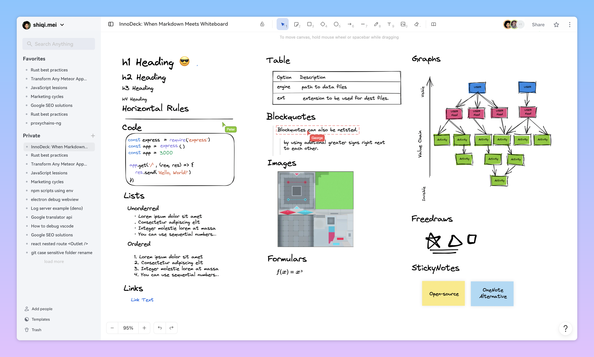

<p align="center">
  <a href="https://markboard.io" target="_blank">
    
  </a>
</p>
<p align="center"><i>Wysiwyg markdown whiteboard for note-taking and building team knowledge base.</i></p>

<p align="center">
 
 
 
 
</p>

<a href="https://markboard.io" target="_blank">

</a>

[Markboard](https://markboard.io) brings together **Markdown** and **Whiteboard** for all your writing, diagramming, sketching, and drawing needs in one place, making your creative process more efficient and effective.

Say goodbye to the hassle of switching between different tools and hello to a more streamlined and collaborative workflow. Try <a href="https://markboard.io" target="_blank">markboard.io</a> now to revolutionize your creative process!

## Core Features

[Website](https://markboard.io) • [Live Demo](https://markboard.io) • [Open Server](https://markboard.io) • [Docs](https://markboard.io/docs) • [Blog](https://markboard.io/blog)

- Collaborative whiteboard
- Wysiwyg markdown
- Cocreate with AI
- Easy to share and publish

## Installation Guide

markboard is an open-source software, you can deploy markboard on your own server without any concern, or you can use our SaaS version by visiting [markboard.io](https://markboard.io).

We officially provide 3 ways of deployment: Digital Ocean, Docker Images and Manual Installation.

### Deploy via DigitalOcean

Deploying markboard with [DigitalOcean](digitalocean.com) is the recommended way to have your own instance running, especially if you are not an expert in linux server or tired of typing a set of commands manually.

Click the folloying button to get your first markboard instance running in minutes:

<p>
  <a href="https://cloud.digitalocean.com/apps/new?repo=https://github.com/markboard/markboard/tree/main" target="_blank">
  
  </a>
</p>

The cost of DigitalOcean's deployment is super low, starting from $5 per instance per month. Our official server [markboard.io](https://markboard.io) is deployed on DigitalOcean too.

### Deploy via docker

> TODO

### Deploy via manual installation

> TODO

## Local Development

```bash
meteor npm install # install dependencies
npm start # local dev
npm start -- --port=1234 # run local dev on port 1234
npm run lint # lint
npm t # test
meteor shell # debugging
```

### Notable Used Tools

- [meteor](https://github.com/meteor/meteor) Meteor, the JavaScript App Platform.
- [excalidraw](https://github.com/excalidraw/excalidraw) Virtual whiteboard for sketching hand-drawn like diagrams.
- [lexical](https://github.com/facebook/lexical) Lexical is an extensible text editor framework that provides excellent reliability, accessibility and performance.
- [yjs](https://github.com/yjs/yjs) A CRDT framework with a powerful abstraction of shared data

### License

[MIT](./LICENSE)
